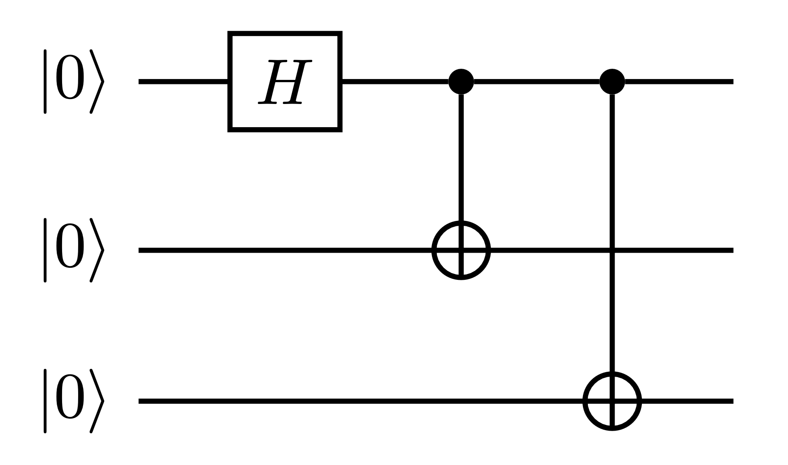

# QuantumGoose

An OCaml library for quantum computing

## Instruction

Compiling the project requires `opam`, `opal`, `dune`, and `ppx_inline_test` to be installed

**To install ocaml/opam**

[ocaml website](https://ocaml.org/docs/up-and-running)

**To setup the project**

```
cd Goose
opam install dune opal ppx_inline_test
```
**To compile**

```
dune build

```

**To test**

```
dune runtest
```

## Examples

### Building a Quantum Circuit in the Goose IR

The following is a quantum circuit that computes [GHZ states](https://en.wikipedia.org/wiki/Greenberger%E2%80%93Horne%E2%80%93Zeilinger_state). This entangles the qubits such that when one is measured, the states of the others are immediately determined.



The following OCaml code generates an n-qubit entanglement circuit, which computes GHZ states.

```ocaml
let entanglement n = {
  qbits = n;
  gates = List.cons ({
    target = A 0;
    kind = H;
    controls = []
  }) (List.init (n - 1) (fun i -> {
    target = A (i + 1);
    kind = X;
    controls = [A 0]
  }))
}
```

### C code emission

The above entanglement circuit can be compiled to C using the symbolic simulator:

```ocaml
open Quantumlib
open C_emitter

CEmitter.emitc (entanglement 3) (open_out "se_c_bin/ent3.c")
```

This produces the following C code for a 3-qubit entanglement circuit:

```c
int main(int argc, char **argv) {
	cfloat *state = (cfloat *) malloc(N * sizeof(cfloat));
	
	// Initialize state
	for (int i = 0; i < N; i++) {
		state[i] = (cfloat) {0.0, 0.0};
	}
	state[0] = (cfloat) {1.0, 0.0};

	// Allocate output state buffer
	cfloat *out_state = (cfloat *) malloc(N * sizeof(cfloat));
	
	out_state[0] = cmul(SQRT1_2,cadd(state[0],state[1]));
	out_state[1] = cmul(SQRT1_2,csub(state[6],state[7]));
	out_state[2] = cmul(SQRT1_2,cadd(state[2],state[3]));
	out_state[3] = cmul(SQRT1_2,csub(state[4],state[5]));
	out_state[4] = cmul(SQRT1_2,cadd(state[4],state[5]));
	out_state[5] = cmul(SQRT1_2,csub(state[2],state[3]));
	out_state[6] = cmul(SQRT1_2,cadd(state[6],state[7]));
	out_state[7] = cmul(SQRT1_2,csub(state[0],state[1]));
	

	// Print state
	for (int i = 0; i < N; i++) {
		printf("|%d>: %f + %fi\n", i, out_state[i].real, out_state[i].imag);
	}	

	return 0;
}
```
